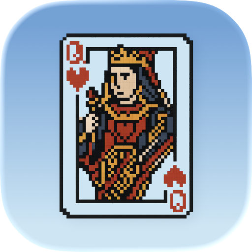

<h1 align="center">
  
   Computer Solitaire
</h1>

Computer Solitaire is a fully native Solitaire app for iOS, iPadOS, and macOS.

  
  

## Features

- Fully native apps for iOS, iPadOS, and macOS
- Automatic game persistence and resume
- Support for 1-card and 3-card Klondike variants
- Customizable table appearance
- Other things you enjoy
