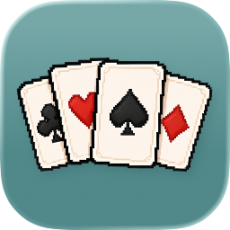
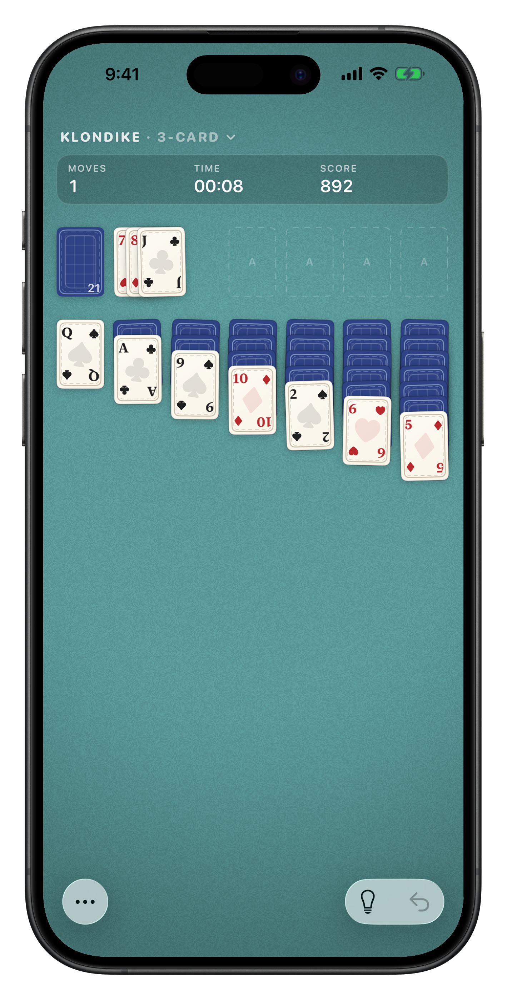
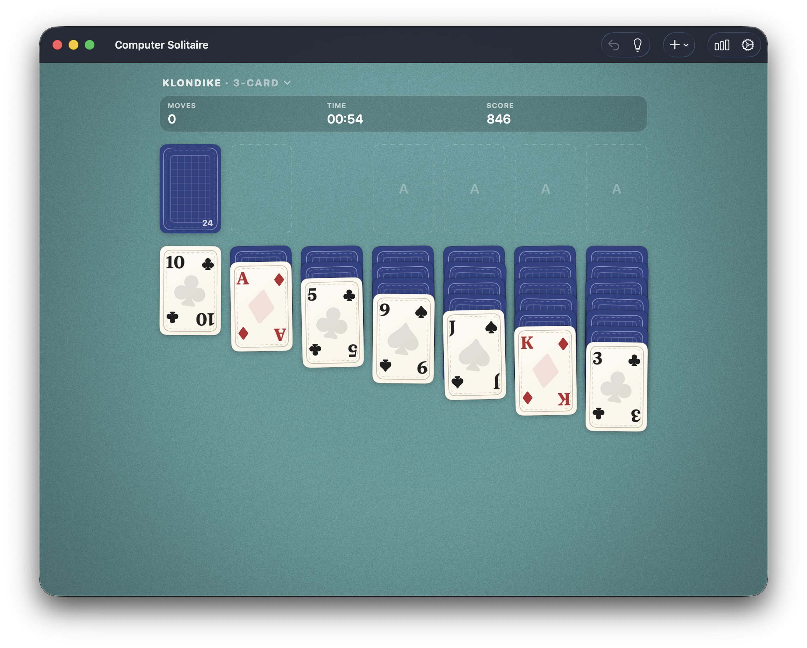

<h1 align="center">
  
   Computer Solitaire
</h1>

Computer Solitaire is a fully native Solitaire app for iOS, iPadOS, and macOS.

  
  

## Features

- Fully native apps for iOS, iPadOS, and macOS
- Multiple game variants: **Klondike** (both 1-card and 3-card draw), **Spider** (1, 2, or 4 suits), **FreeCell**, **Pyramid**, **TriPeaks**, **Golf**, **Yukon**, **Scorpion**, **Forty Thieves**, and **Canfield**
- Automatic game persistence and resume
- Customizable table appearance
- Other things you enjoy

## Game Variants

| Variant | Description | Rules |
|---------|-------------|-------|
| **Klondike** | Classic Solitaire, with 1-card and 3-card draw modes | [Rules](docs/rules/klondike.md) |
| **Spider** | Build full King-to-Ace suit runs across ten piles, using two decks composed of 1, 2, or 4 suits | [Rules](docs/rules/spider.md) |
| **FreeCell** | All 52 cards are dealt face up, with four free cells that each hold one card | [Rules](docs/rules/freecell.md) |
| **Pyramid** | Remove pairs of exposed cards that total 13 to clear a 28-card pyramid | [Rules](docs/rules/pyramid.md) |
| **TriPeaks** | Play uncovered cards one rank above or below the waste to clear three peaks | [Rules](docs/rules/tripeaks.md) |
| **Golf** | Play column cards one rank above or below the waste, scored across a nine-hole match where lower is better | [Rules](docs/rules/golf.md) |
| **Yukon** | Like Klondike, but with no stock — any face-up card moves along with every card stacked on it | [Rules](docs/rules/yukon.md) |
| **Scorpion** | Build down by suit to complete four King-to-Ace runs in place, moving face-up cards with everything stacked on them | [Rules](docs/rules/scorpion.md) |
| **Forty Thieves** | Build ten columns down by suit, one card at a time, using two decks and a single pass through the stock | [Rules](docs/rules/fortythieves.md) |
| **Canfield** | Play a 13-card reserve onto foundations that start at a dealt base rank and wrap | [Rules](docs/rules/canfield.md) |
